

# 机场推荐 2026｜科学上网机场评测与对比 · AIRXVC 领航

**AIRXVC 领航** 是独立的 **机场推荐 / 机场评测** 开源仓库与站点，汇总 31 家高速稳定 **科学上网机场**（翻墙机场 / 代理订阅服务），按线路类型（IEPL 专线、直连、中转）、协议（Trojan、VLESS、Reality、Hysteria2、Shadowsocks）、Netflix / Disney+ / ChatGPT 解锁与性价比横向对比，帮你 3 分钟选对机场。

在线站点：**[air-xvc.github.io](https://air-xvc.github.io/)** ｜ 本仓库：**[air-xvc/air-xvc.github.io](https://github.com/air-xvc/air-xvc.github.io)** ｜ 数据更新：2026-07

精选包括：Mitce、西部数据 WestData、守候 Shouhou、糖果云 CandyCloud、红杏云 HongXing、自由猫 FreeCat 等。价格与优惠码可能随官网调整，请以各机场官网为准。

---

## 目录

- [本仓库是什么](#本仓库是什么)
- [2026 精选机场榜单](#2026-精选机场榜单)
- [Emby 影音机场推荐](#emby-影音机场推荐)
- [机场快速对比表](#机场快速对比表)
- [30 秒教你怎么选机场](#30-秒教你怎么选机场)
- [新手入门：第一次用机场](#新手入门第一次用机场)
- [常见问题 FAQ](#常见问题-faq)
- [相关搜索词](#相关搜索词)
- [免责声明](#免责声明)

---

## 本仓库是什么

很多人搜索「**机场推荐**」「**哪家机场好**」「**科学上网机场**」「**稳定机场评测**」时，会刷到大量广告站或过期榜单。本项目把 **评测内容、对比表、决策指南** 开源在 GitHub，并同步发布到 GitHub Pages，方便检索、收藏与二次核对。

| 项目 | 说明 |
| --- | --- |
| 仓库名 | `air-xvc/air-xvc.github.io` |
| 线上站点 | [https://air-xvc.github.io](https://air-xvc.github.io/) |
| 收录机场 | **31** 家（榜单 + 机场大全） |
| 更新节奏 | 随套餐 / 线路变动维护（当前 2026-07） |
| 数据来源 | 公开套餐信息 + 场景向评测摘要 |
| 使用方式 | 打开站点挑机场，或直接读下方榜单与对比表 |

**你会得到：**

- 按稳定性 / 性价比 / 追剧 / 大流量等场景的 **机场推荐**
- 每家机场的 **线路类型、协议、解锁、起步价、适合人群**
- 独立 SEO 详情页（可分享、可搜索）：例如 [Mitce](https://air-xvc.github.io/mitce/) · [西部数据](https://air-xvc.github.io/westdata/) · [守候](https://air-xvc.github.io/shouhou/) · [糖果云](https://air-xvc.github.io/candycloud/) …
- 新手避坑：月付试水、多机场容灾、客户端与协议匹配

English: Independent **proxy / VPN-like subscription (机场)** reviews and rankings for 2026 — compare IEPL dedicated lines, VLESS Reality, Hysteria2, Trojan, Netflix & ChatGPT unlock, and pricing.

---

## 2026 精选机场榜单

以下为 **31 家机场** 的推荐与评测摘要，按「综合稳定性 + 性价比 + 场景适配」整理。完整图文评测见各机场详情页。

### 01. Mitce 机场推荐  ·  「榜一推荐」

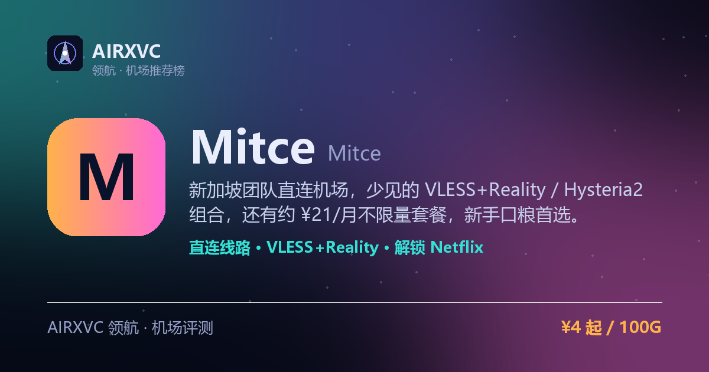

> 新加坡团队直连机场，少见的 VLESS+Reality／Hysteria2 组合，还有约 ¥21/月不限量套餐，新手口粮首选。

- **线路类型**：直连（部分 BGP 中转）
- **主要协议**：VLESS+Reality · Hysteria2
- **流媒体解锁**：Netflix · Disney+ · ChatGPT
- **覆盖地区**：德 · 英 · 港 · 日 · 韩 · 新 · 台 · 美（8 地）
- **起步价**：¥4 起 / 100G（低价包月 / 不限量套餐）
- **最适合**：性价比 / 新手

高性价比“口粮机场”的代表：便宜、有不限量套餐、Reality 抗封能力强，日常刷视频、挂 ChatGPT 很够用。直连线路晚高峰稳定性一般，对线路要求极高者可当备用梯子。

**完整评测与优惠信息 → [Mitce 机场评测](https://air-xvc.github.io/mitce/)**

### 02. 西部数据 WestData 机场推荐  ·  「专线稳王」

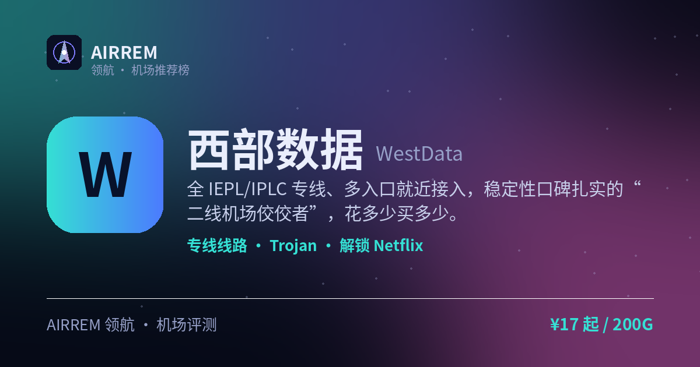

> 全 IEPL/IPLC 专线、多入口就近接入，稳定性口碑扎实的“二线机场佼佼者”，花多少买多少。

- **线路类型**：IEPL/IPLC 全专线
- **主要协议**：Trojan
- **流媒体解锁**：Netflix · Disney+ · ChatGPT
- **覆盖地区**：香港 · 日本 · 美国 · 德国 等
- **起步价**：¥17 起 / 200G（按量计费 ≈ 0.08 元/G）
- **最适合**：稳定专线党

老牌全专线里性价比很高的一家：线路稳、延迟低、按量灵活，把“稳定”放第一位的用户闭眼入门不亏。缺点是双向计流量、偶尔遭攻击，建议先月付试水。

**完整评测与优惠信息 → [西部数据 WestData 机场评测](https://air-xvc.github.io/westdata/)**

### 03. 守候 Shouhou 机场推荐  ·  「老牌稳健」

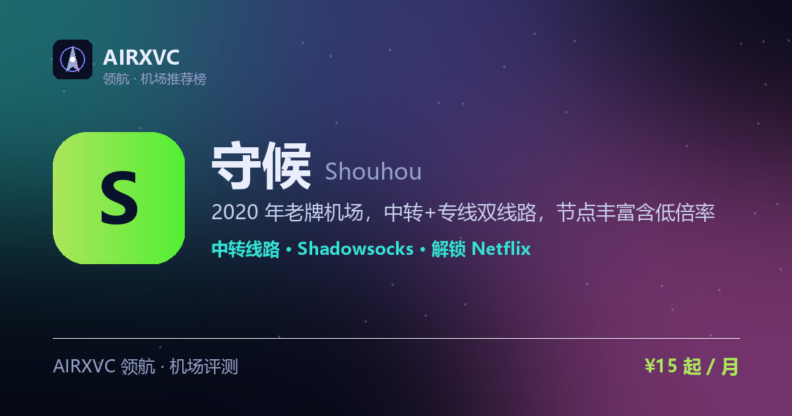

> 2020 年老牌机场，中转+专线双线路，节点丰富含低倍率，并提供 Emby 私人影视库，装上 Emby 客户端登录即看，追剧党省心。

- **线路类型**：公网中转 + IPLC 专线
- **主要协议**：Shadowsocks
- **流媒体解锁**：Netflix · Disney+ · ChatGPT · Emby 影视库
- **覆盖地区**：香港 · 台湾 · 新加坡 · 美国 等 10+ 地区
- **起步价**：¥15 起 / 月（包月 / 包年）
- **最适合**：稳健老用户 / Emby 影音

运营时间较长、节点与入口丰富，提供低倍率节点省流量，还内置 Emby 影视库——相当于自带一个私人影院，稳定、速度快，UP 主也在用；即便老牌也建议先月付观察，再考虑年付。

**完整评测与优惠信息 → [守候 Shouhou 机场评测](https://air-xvc.github.io/shouhou/)**

### 04. 糖果云 CandyCloud 机场推荐  ·  「影视之选」

> 红杏云旗下分站，IEPL 专线主打晚高峰 4K，并内置 Emby 影视库，追剧党的省心之选。

- **线路类型**：IEPL 专线
- **主要协议**：Shadowsocks · V2Ray
- **流媒体解锁**：Netflix · ChatGPT · Emby 影视库
- **覆盖地区**：香港 · 日本 · 新加坡 等
- **起步价**：¥28 起 / 100G（包月 / 季付）
- **最适合**：影视 / 追剧

2025 年新锐，红杏云旗下分站，靠 IEPL 专线 + 内置 Emby 影视库主打“看剧体验”，晚高峰 4K 流畅。属于新机场，建议先月付小档验证稳定性，别一上来大额年付。

**完整评测与优惠信息 → [糖果云 CandyCloud 机场评测](https://air-xvc.github.io/candycloud/)**

### 05. 红杏云 HongXing 机场推荐  ·  「流媒体高性价比」

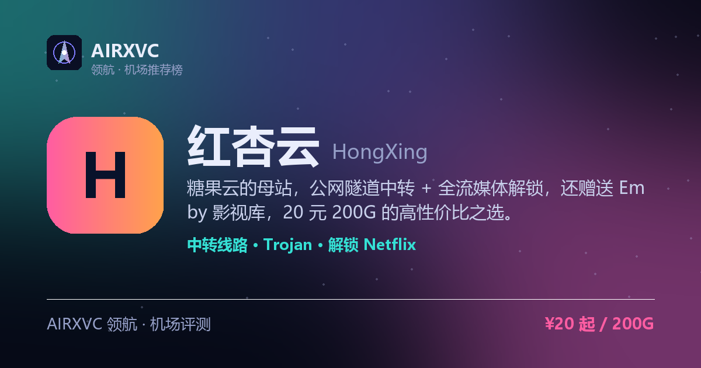

> 糖果云的母站，公网隧道中转 + 全流媒体解锁，还赠送 Emby 影视库，20 元 200G 的高性价比之选。

- **线路类型**：公网隧道中转
- **主要协议**：Trojan · Hysteria2
- **流媒体解锁**：Netflix · Disney+ · ChatGPT · Emby 影视库
- **覆盖地区**：香港 · 日本 · 台湾 · 新加坡 · 美国 等
- **起步价**：¥20 起 / 200G（包月 / 季付）
- **最适合**：流媒体 / 性价比

2024 年新站，把资源砸在流媒体解锁上：Netflix / Disney+ / ChatGPT 全解、4K 秒播、还赠送 Emby 影视库，价格也便宜。想要 IEPL 专线要去它的分站糖果云；新站建议先月付小额验证晚高峰。

**完整评测与优惠信息 → [红杏云 HongXing 机场评测](https://air-xvc.github.io/hongxing/)**

### 06. 自由猫 FreeCat 机场推荐  ·  「日常主力」

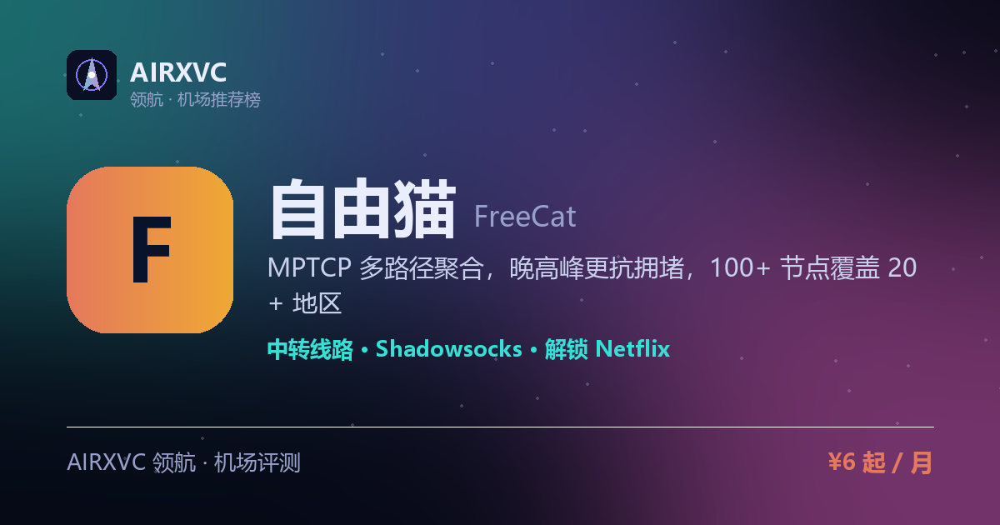

> MPTCP 多路径聚合，晚高峰更抗拥堵，100+ 节点覆盖 20+ 地区

- **线路类型**：MPTCP 多路径中转
- **主要协议**：Shadowsocks · Trojan · VLESS
- **流媒体解锁**：Netflix · Disney+ · ChatGPT
- **覆盖地区**：香港 · 日本 · 美国 · 新加坡 等 20+ 地区
- **起步价**：¥6 起 / 月（包月 / 包季 / 包年）
- **最适合**：日常主力

运营较久、技术路线（MPTCP 多路径）差异化明显，晚高峰稳定性是核心卖点；适配面广，价格与节点以官网为准。

**完整评测与优惠信息 → [自由猫 FreeCat 机场评测](https://air-xvc.github.io/freecat/)**

### 07. 淘气兔 TaoQiTu 机场推荐  ·  「联通移动友好」

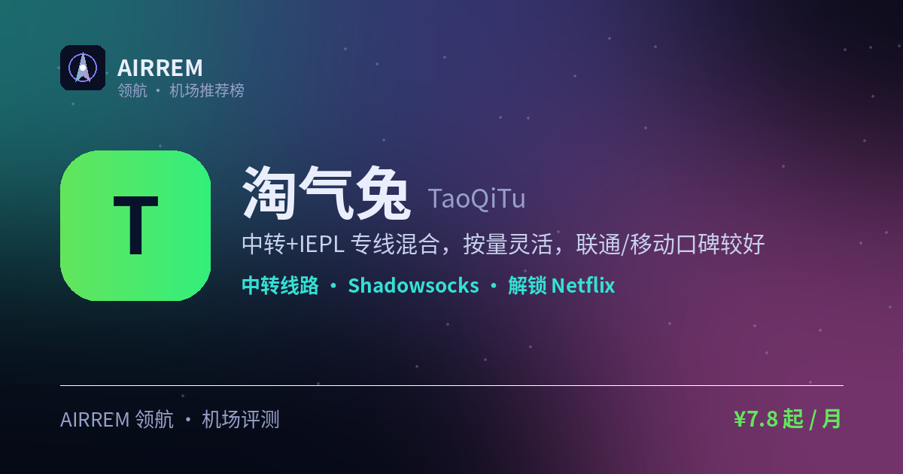

> 中转+IEPL 专线混合，按量灵活，联通/移动口碑较好

- **线路类型**：中转 + IEPL 专线
- **主要协议**：Shadowsocks · Trojan
- **流媒体解锁**：Netflix · ChatGPT
- **覆盖地区**：日本 · 香港 等（Amazon 中转为主）
- **起步价**：¥7.8 起 / 月（包月 / 按量）
- **最适合**：联通移动用户

有普通中转与 IEPL 专线（2 倍率）两种选择，性价比不错；但电信用户（尤其粤/苏）可能遇 QoS 限速，非电信用户优先，先小额验证。

**完整评测与优惠信息 → [淘气兔 TaoQiTu 机场评测](https://air-xvc.github.io/taoqitu/)**

### 08. 渔云 YuYun 机场推荐  ·  「专线新锐」

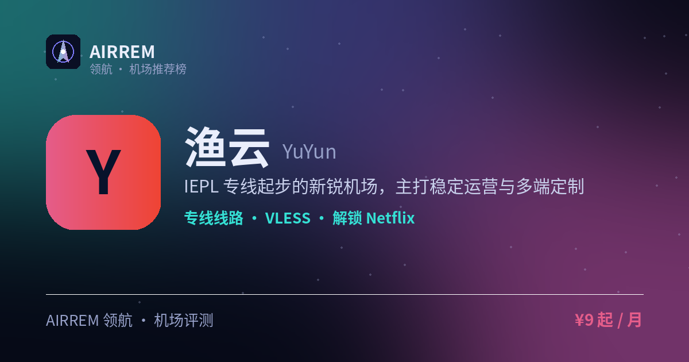

> IEPL 专线起步的新锐机场，主打稳定运营与多端定制，全套餐赠送 Emby 影视库，追剧观影一步到位。

- **线路类型**：IEPL 专线 + 中转
- **主要协议**：VLESS · Hysteria2
- **流媒体解锁**：Netflix · Disney+ · ChatGPT · Emby 影视库
- **覆盖地区**：香港 · 日本 · 台湾 · 新加坡 · 美国 等
- **起步价**：¥9 起 / 月（包月 / 按量）
- **最适合**：长期稳定 / Emby 影音

节点覆盖主流地区、协议较新，定位长期稳定而非低价冲量，且各档套餐均赠送 Emby 影视库——装上 Emby 客户端登录即看，稳定、速度快，UP 主在用；新站建议先月付小额验证再长期用。

**完整评测与优惠信息 → [渔云 YuYun 机场评测](https://air-xvc.github.io/yuyun/)**

### 09. 好鸭 NiceDuck 机场推荐  ·  「追剧全能」

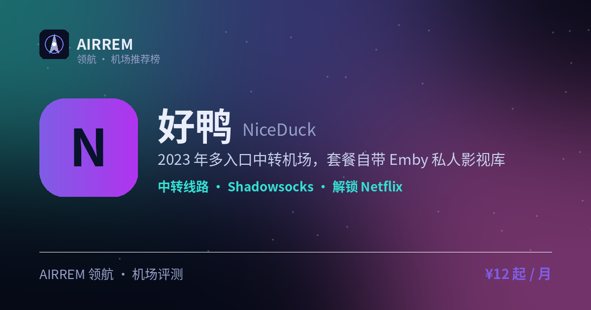

> 2023 年多入口中转机场，套餐自带 Emby 私人影视库

- **线路类型**：多入口隧道中转
- **主要协议**：Shadowsocks
- **流媒体解锁**：Netflix · Disney+ · YouTube · ChatGPT · Emby 影视库
- **覆盖地区**：香港 · 日本 · 台湾 · 新加坡 · 美国 · 韩国 · 澳门 等
- **起步价**：¥12 起 / 月（包月 / 包季 / 包年）
- **最适合**：追剧兼解锁

多入口中转国内接入较友好，绑定 Emby 影视库是差异化卖点，暂未见大规模跑路；协议仅 SS，仍建议先月付验证。

**完整评测与优惠信息 → [好鸭 NiceDuck 机场评测](https://air-xvc.github.io/niceduck/)**

### 10. 流量光 LiuLiangGuang 机场推荐  ·  「流媒体重度」

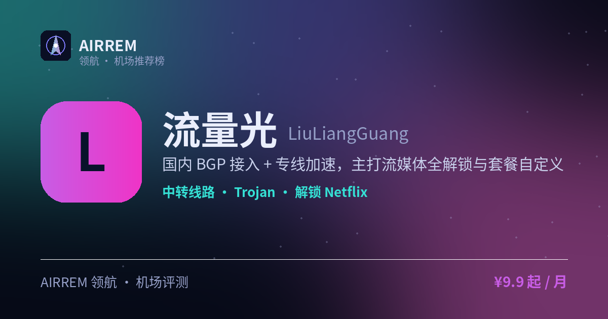

> 国内 BGP 接入 + 专线加速，主打流媒体全解锁与套餐自定义

- **线路类型**：BGP 中转 + 专线可选
- **主要协议**：Trojan · Shadowsocks
- **流媒体解锁**：Netflix · Disney+ · HBO · Spotify · TikTok · ChatGPT
- **覆盖地区**：主流地区 + 含冷门国家（以官网为准）
- **起步价**：¥9.9 起 / 月（包月 / 自定义）
- **最适合**：流媒体重度

节点多、解锁范围覆盖主流流媒体与 ChatGPT，支持流量/设备自定义，灵活性好；定位偏中高价位，先月付验证晚高峰再买大额。

**完整评测与优惠信息 → [流量光 LiuLiangGuang 机场评测](https://air-xvc.github.io/llguang/)**

### 11. 快雷GO Kuailei GO 机场推荐  ·  「晚高峰加速」

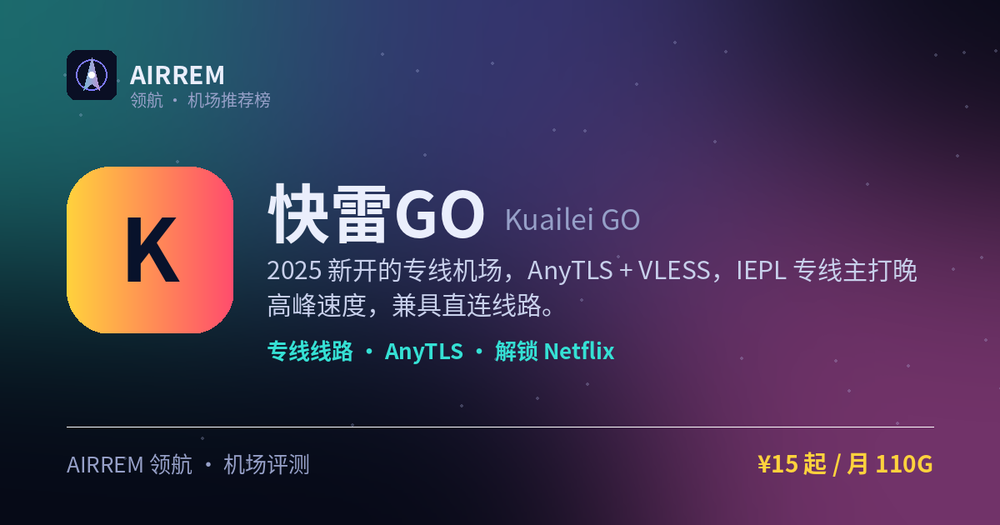

> 2025 新开的专线机场，AnyTLS + VLESS，IEPL 专线主打晚高峰速度，兼具直连线路。

- **线路类型**：IEPL 专线 + 直连
- **主要协议**：AnyTLS · VLESS
- **流媒体解锁**：Netflix · Disney+ · ChatGPT · TikTok
- **覆盖地区**：香港 · 日本 · 台湾 · 美国 · 新加坡 · 马来西亚 等
- **起步价**：¥15 起 / 月 110G（月付 / 季付 / 半年 / 年付）
- **最适合**：晚高峰 / 速度

快雷GO（也写作快雷狗）是 2025 年新开的机场，采用 AnyTLS + VLESS，走 IEPL 专线并搭配直连，落地覆盖港日台美新马等地。多家测评把它归为「晚高峰速度较快」的一档，套餐档位清晰、从 110G 到 500G 都有。作为新机场，建议先月付小档验证稳定性，别一上来大额年付，并常备第二家互为容灾。

**完整评测与优惠信息 → [快雷GO Kuailei GO 机场评测](https://air-xvc.github.io/kuailei/)**

### 12. NiceCloud 机场推荐  ·  「灵活流量」

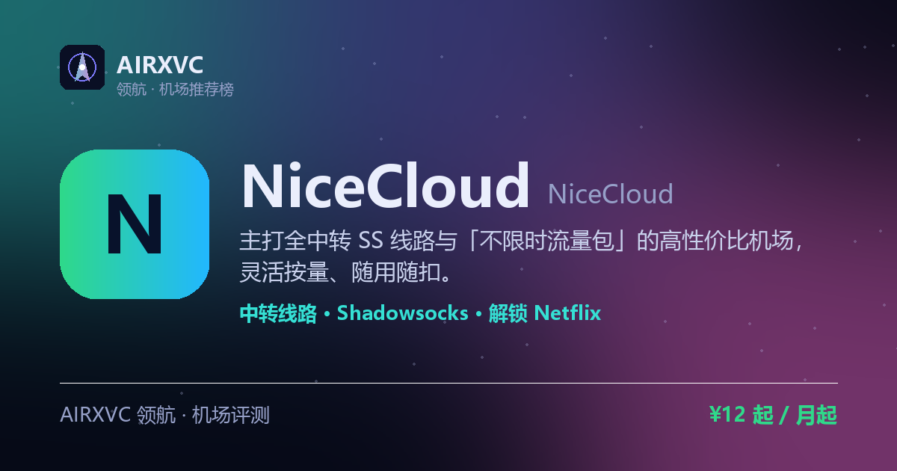

> 主打全中转 SS 线路与「不限时流量包」的高性价比机场，灵活按量、随用随扣。

- **线路类型**：公网中转隧道
- **主要协议**：Shadowsocks · SSR
- **流媒体解锁**：Netflix · Disney+ · ChatGPT · TikTok
- **覆盖地区**：香港 · 日本 · 台湾 · 美国 · 新加坡 等
- **起步价**：¥12 起 / 月起（月付 / 按量 / 不限时流量包）
- **最适合**：性价比 / 灵活流量

2022 年上线的中转机场，卖点是灵活的按量与不限时流量包，SS 全中转线路、流媒体与 ChatGPT 解锁比较稳，价格亲民。注意它走国内中转并做常规审计，Netflix 偶有短暂失效；市面上有同名山寨站，认准测评跳转链接进官网。属于适合当备用或轻中度主力的性价比之选，建议先按量或月付小档试用。

**完整评测与优惠信息 → [NiceCloud 机场评测](https://air-xvc.github.io/nicecloud/)**

### 13. OuO 机场推荐

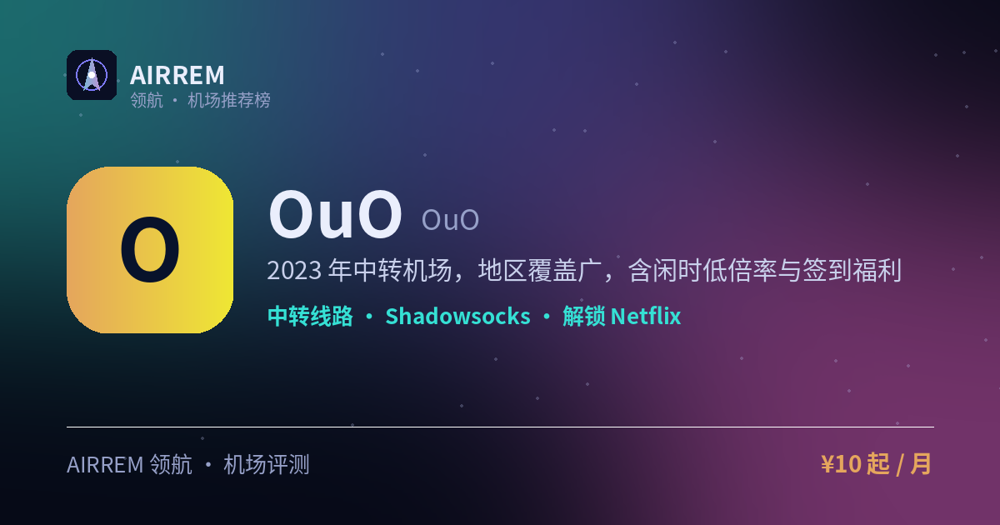

> 2023 年中转机场，地区覆盖广，含闲时低倍率与签到福利

- **线路类型**：公网隧道中转
- **主要协议**：Shadowsocks
- **流媒体解锁**：Netflix · Disney+ · YouTube · TikTok · ChatGPT
- **覆盖地区**：香港 · 日本 · 台湾 · 新加坡 · 美国 · 德国 · 英国 等
- **起步价**：¥10 起 / 月（包月 / 包季 / 包年）
- **最适合**：多地区解锁

节点地区多、解锁场景全，闲时低倍率是加分项；第三方口碑两极、部分反馈售后偏慢，建议先小额月付实测。

**完整评测与优惠信息 → [OuO 机场评测](https://air-xvc.github.io/ouo/)**

### 14. 69云 69Yun 机场推荐

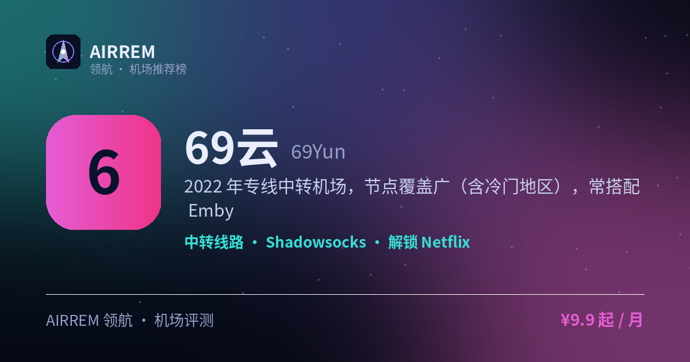

> 2022 年专线中转机场，节点覆盖广（含冷门地区），并提供 Emby 影视库，装上客户端登录即看，追剧党友好。

- **线路类型**：专线中转
- **主要协议**：Shadowsocks · VMess
- **流媒体解锁**：Netflix · Disney+ · HBO · ChatGPT · Emby 影视库
- **覆盖地区**：亚洲 · 欧美 · 含多个冷门地区
- **起步价**：¥9.9 起 / 月（包月 / 按量）
- **最适合**：冷门地区 / Emby 影音

节点覆盖面广、冷门地区有优势，套餐多样，还提供 Emby 影视库——登录即看片，稳定、速度快，UP 主在用，适合主力或备用；建议先低价月付验证晚高峰与解锁，再考虑长期。

**完整评测与优惠信息 → [69云 69Yun 机场评测](https://air-xvc.github.io/yun69/)**

### 15. 蛋挞机场 DanTa 机场推荐

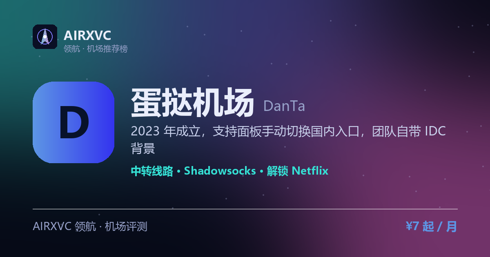

> 2023 年成立，支持面板手动切换国内入口，团队自带 IDC 背景

- **线路类型**：公网隧道中转 + IEPL 专线
- **主要协议**：Shadowsocks
- **流媒体解锁**：Netflix · Disney+ · YouTube Premium · ChatGPT · TikTok
- **覆盖地区**：港台新 · 日美韩 等，另有澳门等冷门节点
- **起步价**：¥7 起 / 月（包月 / 按量）
- **最适合**：多入口进阶

亮点是可在面板手动挑国内入口（同类少见），团队做 IDC 出身、后续加入 IEPL 专线，诚意在线；新站且换过站长，建议先免费试用/月付观察过渡期。

**完整评测与优惠信息 → [蛋挞机场 DanTa 机场评测](https://air-xvc.github.io/danta/)**

### 16. KTM Cloud 机场推荐

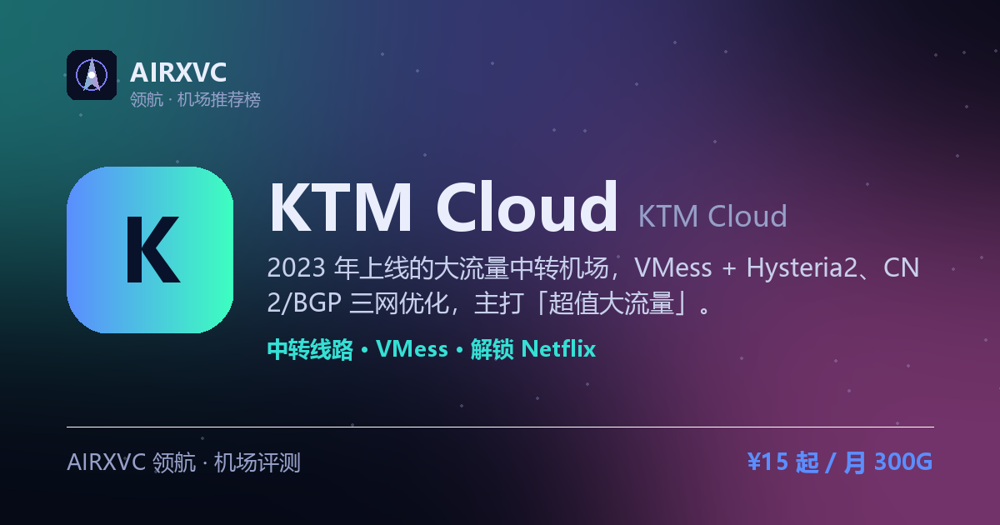

> 2023 年上线的大流量中转机场，VMess + Hysteria2、CN2/BGP 三网优化，主打「超值大流量」。

- **线路类型**：CN2/BGP 中转 + 专线
- **主要协议**：VMess · Hysteria2
- **流媒体解锁**：Netflix · Disney+ · ChatGPT · TikTok
- **覆盖地区**：香港 · 日本 · 美国 · 新加坡 · 德国 · 韩国 · 台湾 等
- **起步价**：¥15 起 / 月 300G（月付 / 永久流量包）
- **最适合**：大流量 / 性价比

KTM Cloud 是 2023 年上线的中转机场，采用 VMess + Hysteria2 双协议、CN2/BGP 三网优化，卖点是「便宜大碗」的大流量与永久流量包，不限设备、支付宝/微信付款方便。它覆盖港日美新德韩台等地，日常追剧与 ChatGPT 可用，但解锁与稳定性在测评中有一定争议，官网也曾出现因被攻击而中断的情况。适合预算有限、流量需求大的用户当性价比主力或备用，务必先小额验证、别大额预付。

**完整评测与优惠信息 → [KTM Cloud 机场评测](https://air-xvc.github.io/ktmcloud/)**

### 17. 牛逼 Niubi 机场推荐

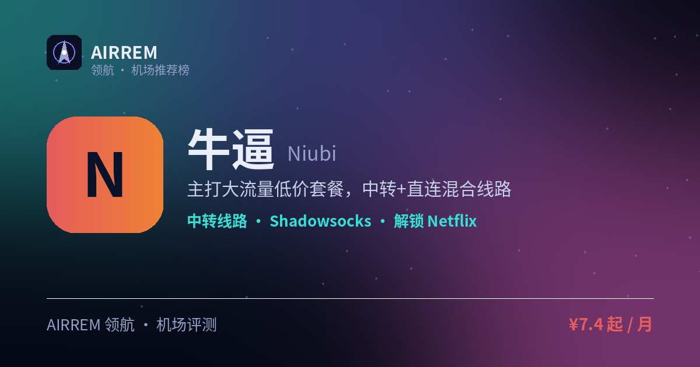

> 主打大流量低价套餐，中转+直连混合线路

- **线路类型**：公网中转 + 直连混合
- **主要协议**：Shadowsocks · VMess · Trojan
- **流媒体解锁**：Netflix · Disney+ · ChatGPT
- **覆盖地区**：香港 · 日本 · 新加坡 · 美国 等
- **起步价**：¥7.4 起 / 月（包月 / 按量）
- **最适合**：大流量党

以超大流量、低单价为卖点，日常刷剧下载性价比高；低价机场稳定性一般，建议先月付小额验证。

**完整评测与优惠信息 → [牛逼 Niubi 机场评测](https://air-xvc.github.io/niubi/)**

### 18. 雪山机场 XueShan 机场推荐

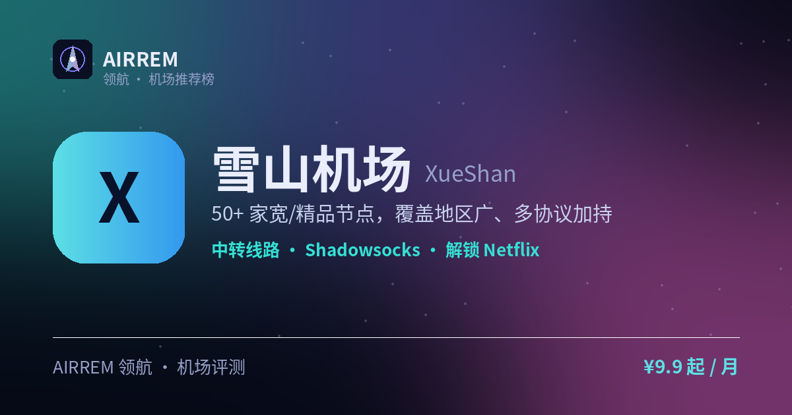

> 50+ 家宽/精品节点，覆盖地区广、多协议加持

- **线路类型**：家宽 / 中转线路
- **主要协议**：Shadowsocks · Trojan · Hysteria2 · VLESS
- **流媒体解锁**：Netflix · Disney+ · ChatGPT
- **覆盖地区**：香港 · 台湾 · 韩国 · 日本 · 新加坡 · 美国 · 德国 · 法国 · 俄罗斯 等
- **起步价**：¥9.9 起 / 月（包月 / 包年 / 流量包）
- **最适合**：日常全能

2025 年上线，主打节点多、覆盖广，家宽/中转配合多协议，适合视频/会议/ChatGPT 日常；作为较新机场，建议先小额付费观察稳定性。

**完整评测与优惠信息 → [雪山机场 XueShan 机场评测](https://air-xvc.github.io/xueshan/)**

### 19. 游隼云 YouSun 机场推荐

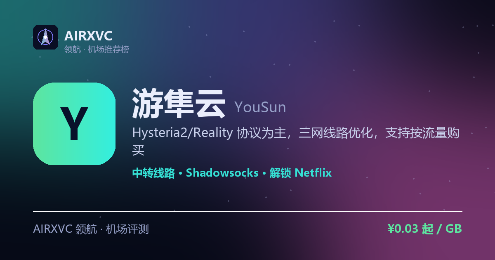

> Hysteria2/Reality 协议为主，三网线路优化，支持按流量购买

- **线路类型**：三网优化中转
- **主要协议**：Shadowsocks · Trojan · Hysteria2
- **流媒体解锁**：Netflix · Disney+ · ChatGPT
- **覆盖地区**：美国 · 日本 · 香港 · 台湾 · 新加坡 等
- **起步价**：¥0.03 起 / GB（包月 / 按流量）
- **最适合**：按量轻用户

主打大流量与多地区原生 IP，协议较新、抗封是卖点，按量适合用量不固定；节点数与真实速度建议自行小额测试。

**完整评测与优惠信息 → [游隼云 YouSun 机场评测](https://air-xvc.github.io/yousun/)**

### 20. Hneko云机场 Hneko 机场推荐

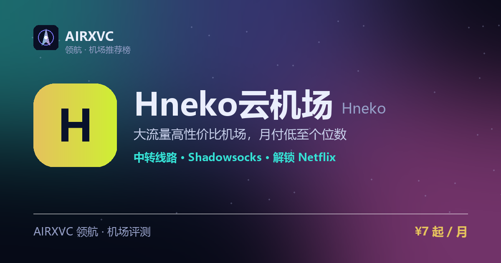

> 大流量高性价比机场，月付低至个位数

- **线路类型**：公网隧道中转
- **主要协议**：Shadowsocks · Trojan · VMess
- **流媒体解锁**：Netflix · ChatGPT
- **覆盖地区**：香港 · 日本 · 美国 等
- **起步价**：¥7 起 / 月（包月 / 包年 / 不限时）
- **最适合**：大流量党

以大流量、低价著称，套餐含月付/年付/不限时多种；据用户反馈节点稳定性时有波动、需留意订阅更新，建议先月付验证。

**完整评测与优惠信息 → [Hneko云机场 Hneko 机场评测](https://air-xvc.github.io/hneko/)**

### 21. 超实惠加速 ChaoShiHui 机场推荐

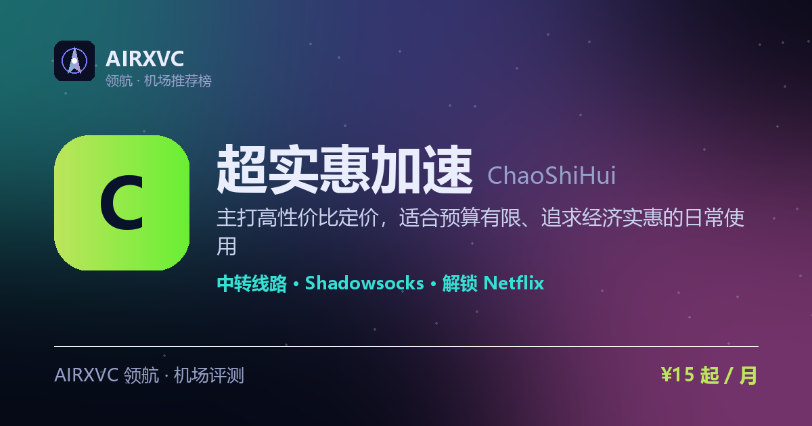

> 主打高性价比定价的日常机场，并提供 Emby 影视库，花小钱也能追剧观影，追剧党的平价之选。

- **线路类型**：中转 / 直连（以官网为准）
- **主要协议**：Shadowsocks · Trojan · VLESS
- **流媒体解锁**：Netflix · ChatGPT · Emby 影视库
- **覆盖地区**：香港 · 日本 · 美国 等（以官网为准）
- **起步价**：¥15 起 / 月（包月 / 按量）
- **最适合**：高性价比 / Emby 影音

定位「价格实惠、够用就好」，适合日常轻中度使用，还提供 Emby 影视库——装上客户端登录即看，稳定、速度快，UP 主在用；公开独立测速数据有限，套餐与稳定性以官网为准，先小额验证。

**完整评测与优惠信息 → [超实惠加速 ChaoShiHui 机场评测](https://air-xvc.github.io/chaoshihui/)**

### 22. 凌云加速 LingYun 机场推荐

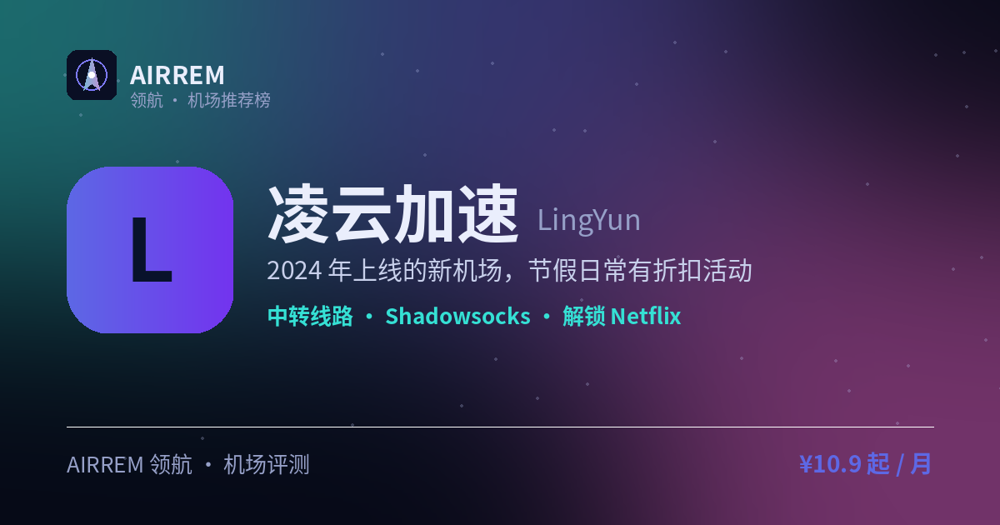

> 2024 年上线的新机场，节假日常有折扣活动

- **线路类型**：中转（线路细节未公开确认）
- **主要协议**：Shadowsocks · Trojan · VMess
- **流媒体解锁**：Netflix · Disney+ · ChatGPT
- **覆盖地区**：香港 · 日本 · 美国 等（以官网为准）
- **起步价**：¥10.9 起 / 月（包月 / 包季 / 包年）
- **最适合**：低价尝鲜

成立时间较短、公开评测有限，社区有个别关于稳定性/客服的负面反馈；建议只用最低档月付实测，确认稳定再续。

**完整评测与优惠信息 → [凌云加速 LingYun 机场评测](https://air-xvc.github.io/lingyun/)**

### 23. 极速机场 JiSu 机场推荐

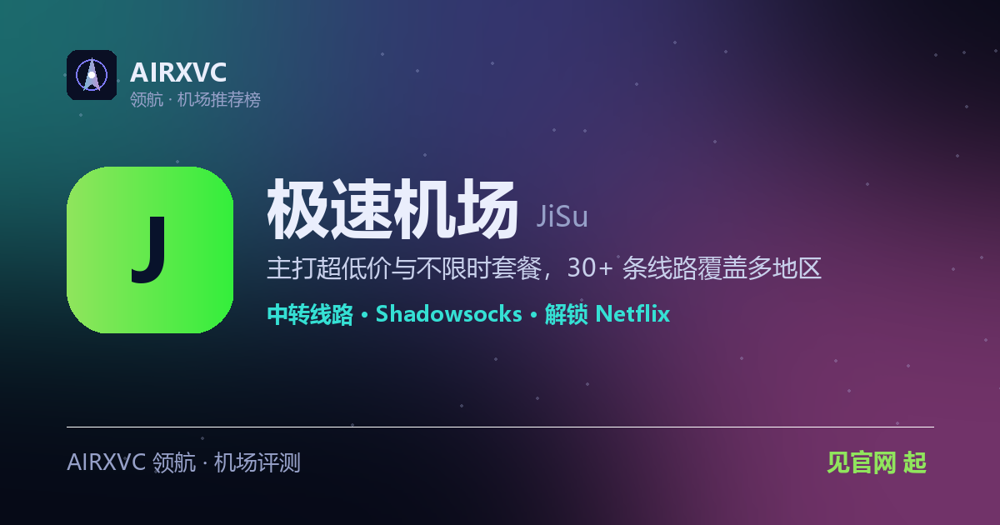

> 主打超低价与不限时套餐，30+ 条线路覆盖多地区

- **线路类型**：中转（多线路）
- **主要协议**：Shadowsocks · Trojan · Hysteria2
- **流媒体解锁**：Netflix · Disney+ · ChatGPT
- **覆盖地区**：香港 · 日本 · 新加坡 · 美国 等 30+ 线路
- **起步价**：见官网 起 （包月 / 按量 / 包年）
- **最适合**：预算优先入门

低价入门档，套餐偏大众化的按量+不限时组合，性价比是主卖点；低价机场抗风险能力有限，先小额月付验证。

**完整评测与优惠信息 → [极速机场 JiSu 机场评测](https://air-xvc.github.io/jisu/)**

### 24. 良心云 Liangxin 机场推荐

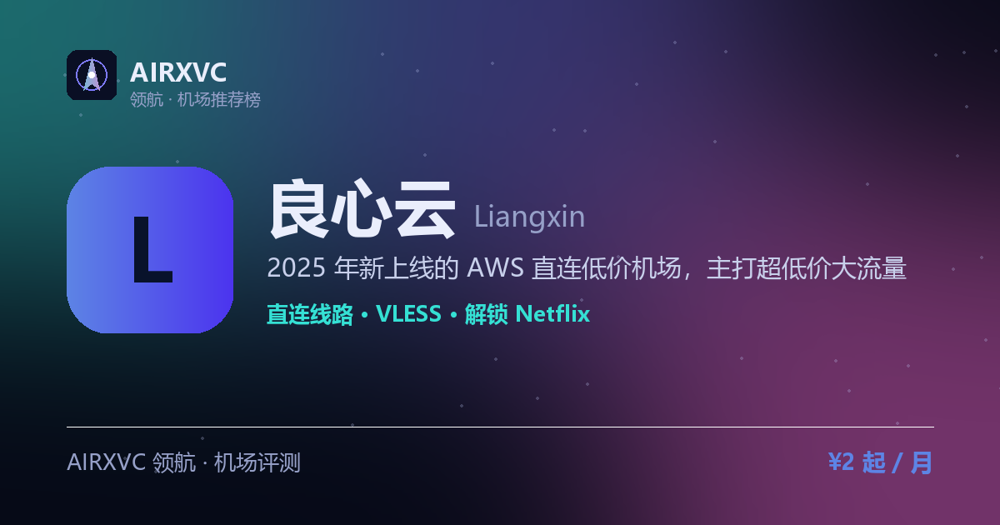

> 2025 年新上线的 AWS 直连低价机场，主打超低价大流量

- **线路类型**：AWS 直连线路
- **主要协议**：VLESS · Hysteria2
- **流媒体解锁**：Netflix · Disney+ · ChatGPT · TikTok
- **覆盖地区**：香港 · 日本 · 新加坡 · 韩国 · 美国 等
- **起步价**：¥2 起 / 月（包月 / 按量）
- **最适合**：低价尝鲜党

价格低、协议新（VLESS/Hy2），解锁反馈尚可；但运营时间短、直连机场普遍不稳定，强烈建议只用最低档月付观察，别直接年付。

**完整评测与优惠信息 → [良心云 Liangxin 机场评测](https://air-xvc.github.io/liangxin/)**

### 25. 一分机场 YiFen 机场推荐

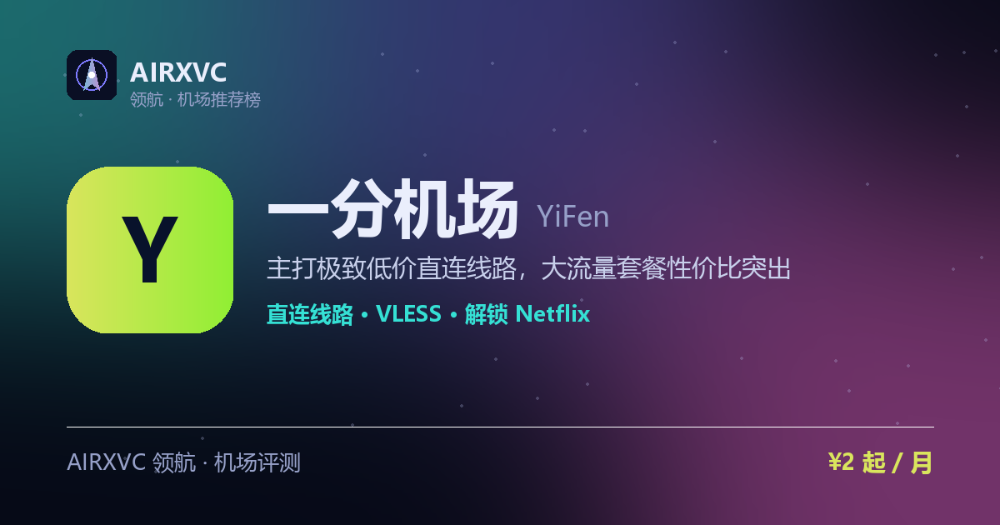

> 主打极致低价直连线路，大流量套餐性价比突出

- **线路类型**：直连（大厂云，无专线）
- **主要协议**：VLESS · Hysteria2
- **流媒体解锁**：Netflix · ChatGPT · bilibili
- **覆盖地区**：三网直连线路（地区以官网为准）
- **起步价**：¥2 起 / 月（包月 / 不限时）
- **最适合**：低价大流量

低价直连+大流量为卖点，价格档位丰富、日常性价比高；直连稳定性不及专线、晚高峰可能波动，先最低档月付验证再加量。

**完整评测与优惠信息 → [一分机场 YiFen 机场评测](https://air-xvc.github.io/yifen/)**

### 26. 顶级机场 DingJi 机场推荐

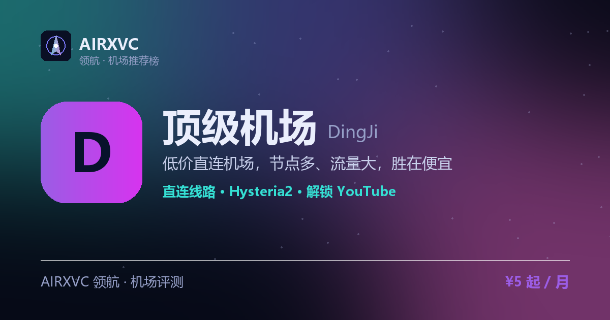

> 低价直连机场，节点多、流量大，胜在便宜

- **线路类型**：公网直连
- **主要协议**：Hysteria2 · VLESS
- **流媒体解锁**：YouTube · ChatGPT
- **覆盖地区**：美国 · 日本 · 香港 · 台湾 · 新加坡 · 韩国 等
- **起步价**：¥5 起 / 月（包月 / 按量）
- **最适合**：价格敏感重流量

走直连路线（Azure/AWS 入口），价格低、节点流量足，适合价格极敏感的大流量用户；速度受本地运营商影响大、节点 IP 更新频繁，不适合商务稳定场景。

**完整评测与优惠信息 → [顶级机场 DingJi 机场评测](https://air-xvc.github.io/dingji/)**

### 27. 赔钱机场 PeiQian 机场推荐

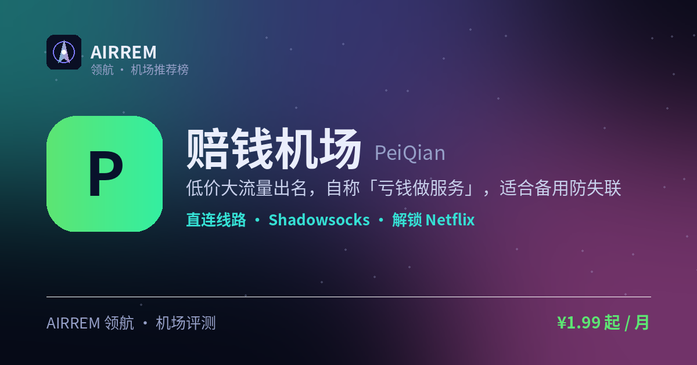

> 低价大流量出名，自称「亏钱做服务」，适合备用防失联

- **线路类型**：全直连 / 部分中转
- **主要协议**：Shadowsocks · Trojan · VMess · VLESS · Hysteria2
- **流媒体解锁**：Netflix · ChatGPT · TikTok
- **覆盖地区**：香港 · 日本 · 美国 · 新加坡 等（含甲骨文云节点）
- **起步价**：¥1.99 起 / 月（包月流量包 / 不限时）
- **最适合**：极致低价备用

价格数一数二便宜、流量给得足，还有 0.1/0.01 超低倍率节点可薅；但全直连晚高峰与电信体验有限，建议只当备用、先月付小额验证。

**完整评测与优惠信息 → [赔钱机场 PeiQian 机场评测](https://air-xvc.github.io/peiqian/)**

### 28. 卷王机场 JuanWang 机场推荐

> 注册即送大额一次性流量包，节点覆盖国家多

- **线路类型**：公网隧道中转
- **主要协议**：Hysteria · Trojan · VLESS · VMess
- **流媒体解锁**：ChatGPT · TikTok
- **覆盖地区**：美国 · 香港 · 台湾 · 新加坡 · 日本 · 英国 · 加拿大 · 德国 等 11 地区
- **起步价**：免费试用 起 （注册送流量 / 付费套餐）
- **最适合**：免费试水

亮点是注册免费送的大流量套餐和覆盖 11 个地区的节点，适合零成本先体验；公开深度评测与长期数据较少，建议把免费套餐当体验装，满意再付费。

**完整评测与优惠信息 → [卷王机场 JuanWang 机场评测](https://air-xvc.github.io/juanwang/)**

### 29. 清风云 QingFeng 机场推荐

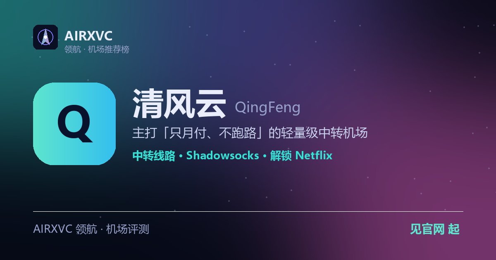

> 主打「只月付、不跑路」的轻量级中转机场，并提供 Emby 影视库，低成本也能追剧观影。

- **线路类型**：公网隧道中转
- **主要协议**：Shadowsocks · VLESS · Hysteria
- **流媒体解锁**：Netflix · ChatGPT · Emby 影视库
- **覆盖地区**：香港 · 日本 · 美国 等
- **起步价**：见官网 起 （包月 / 按量）
- **最适合**：新手轻量 / Emby 影音

定位入门轻量、主打月付不跑路，还提供 Emby 影视库——装上客户端登录即看，稳定、速度快，UP 主在用；公开评测较少，节点与稳定性建议自行小额验证，不建议大额年付。

**完整评测与优惠信息 → [清风云 QingFeng 机场评测](https://air-xvc.github.io/qingfeng/)**

### 30. 飞狗 FeiGou 机场推荐

> 低价入门机场，日常刷剧冲浪够用

- **线路类型**：公网隧道中转
- **主要协议**：Shadowsocks · Trojan · VMess
- **流媒体解锁**：Netflix · YouTube · ChatGPT
- **覆盖地区**：香港 · 台湾 · 日本 · 美国 等
- **起步价**：见官网 起 （包月 / 包季）
- **最适合**：低价备用

低价走量入门机场，轻度使用性价比尚可；但公开信息显示历史上出现过域名失联、需另找新址的情况，稳定性存疑，不建议作唯一主力。

**完整评测与优惠信息 → [飞狗 FeiGou 机场评测](https://air-xvc.github.io/feigou/)**

### 31. 神龙 ShenLong 机场推荐

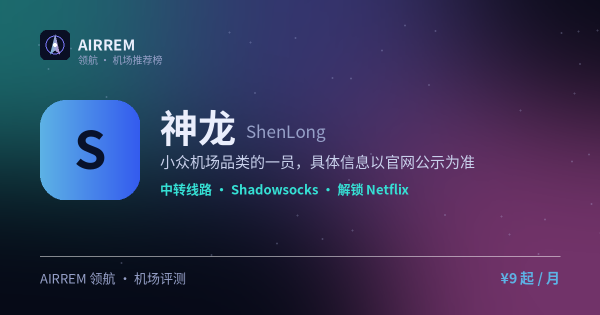

> 小众机场品类的一员，具体信息以官网公示为准

- **线路类型**：中转 / 专线（以官网为准）
- **主要协议**：Shadowsocks · VMess · Trojan
- **流媒体解锁**：Netflix · ChatGPT
- **覆盖地区**：以官网公布为准
- **起步价**：¥9 起 / 月（包月 / 按量）
- **最适合**：小众探索

目前公开可核实的评测资料较少，暂无法给出具体口碑；建议先通过官方渠道确认最新详情，并从月付小额开始验证。

**完整评测与优惠信息 → [神龙 ShenLong 机场评测](https://air-xvc.github.io/shenlong/)**

## Emby 影音机场推荐

下面这几家在订阅之外还 **内置 / 赠送 Emby 私人影视库**：装上 Emby 客户端、用机场提供的账号登录即可在线看片，相当于自带一个「私人奈飞」，省去自己找片源。它们 **稳定、速度快，UP 主与追剧党常用**。片源、清晰度与可用性以各机场官网实时信息为准。

- 🎬 **[守候 Shouhou](https://air-xvc.github.io/shouhou/)** — 2020 年老牌机场，中转+专线双线路，节点丰富含低倍率，并提供 Emby 私人影视库，装上 Emby 客户端登录即看，追剧党省心。
- 🎬 **[糖果云 CandyCloud](https://air-xvc.github.io/candycloud/)** — 红杏云旗下分站，IEPL 专线主打晚高峰 4K，并内置 Emby 影视库，追剧党的省心之选。
- 🎬 **[红杏云 HongXing](https://air-xvc.github.io/hongxing/)** — 糖果云的母站，公网隧道中转 + 全流媒体解锁，还赠送 Emby 影视库，20 元 200G 的高性价比之选。
- 🎬 **[渔云 YuYun](https://air-xvc.github.io/yuyun/)** — IEPL 专线起步的新锐机场，主打稳定运营与多端定制，全套餐赠送 Emby 影视库，追剧观影一步到位。
- 🎬 **[好鸭 NiceDuck](https://air-xvc.github.io/niceduck/)** — 2023 年多入口中转机场，套餐自带 Emby 私人影视库
- 🎬 **[69云 69Yun](https://air-xvc.github.io/yun69/)** — 2022 年专线中转机场，节点覆盖广（含冷门地区），并提供 Emby 影视库，装上客户端登录即看，追剧党友好。
- 🎬 **[超实惠加速 ChaoShiHui](https://air-xvc.github.io/chaoshihui/)** — 主打高性价比定价的日常机场，并提供 Emby 影视库，花小钱也能追剧观影，追剧党的平价之选。
- 🎬 **[清风云 QingFeng](https://air-xvc.github.io/qingfeng/)** — 主打「只月付、不跑路」的轻量级中转机场，并提供 Emby 影视库，低成本也能追剧观影。

## 机场快速对比表

一张表看懂 **机场对比**：线路、协议、解锁能力、起步价与适用场景。适合搜索「机场哪家好」「机场性价比对比」时快速筛选。

| 机场 | 线路类型 | 主要协议 | 解锁 | 起步价 | 最适合 |
| --- | --- | --- | --- | --- | --- |
| [Mitce](https://air-xvc.github.io/mitce/) | 直连（部分 BGP 中转） | VLESS+Reality · Hysteria2 | Netflix · Disney+ · ChatGPT | ¥4 / 100G | 性价比 / 新手 |
| [西部数据](https://air-xvc.github.io/westdata/) | IEPL/IPLC 全专线 | Trojan | Netflix · Disney+ · ChatGPT | ¥17 / 200G | 稳定专线党 |
| [守候](https://air-xvc.github.io/shouhou/) | 公网中转 + IPLC 专线 | Shadowsocks | Netflix · Disney+ · ChatGPT · Emby 影视库 | ¥15 / 月 | 稳健老用户 / Emby 影音 |
| [糖果云](https://air-xvc.github.io/candycloud/) | IEPL 专线 | Shadowsocks · V2Ray | Netflix · ChatGPT · Emby 影视库 | ¥28 / 100G | 影视 / 追剧 |
| [红杏云](https://air-xvc.github.io/hongxing/) | 公网隧道中转 | Trojan · Hysteria2 | Netflix · Disney+ · ChatGPT · Emby 影视库 | ¥20 / 200G | 流媒体 / 性价比 |
| [自由猫](https://air-xvc.github.io/freecat/) | MPTCP 多路径中转 | Shadowsocks · Trojan · VLESS | Netflix · Disney+ · ChatGPT | ¥6 / 月 | 日常主力 |
| [淘气兔](https://air-xvc.github.io/taoqitu/) | 中转 + IEPL 专线 | Shadowsocks · Trojan | Netflix · ChatGPT | ¥7.8 / 月 | 联通移动用户 |
| [渔云](https://air-xvc.github.io/yuyun/) | IEPL 专线 + 中转 | VLESS · Hysteria2 | Netflix · Disney+ · ChatGPT · Emby 影视库 | ¥9 / 月 | 长期稳定 / Emby 影音 |
| [好鸭](https://air-xvc.github.io/niceduck/) | 多入口隧道中转 | Shadowsocks | Netflix · Disney+ · YouTube · ChatGPT · Emby 影视库 | ¥12 / 月 | 追剧兼解锁 |
| [流量光](https://air-xvc.github.io/llguang/) | BGP 中转 + 专线可选 | Trojan · Shadowsocks | Netflix · Disney+ · HBO · Spotify · TikTok · ChatGPT | ¥9.9 / 月 | 流媒体重度 |
| [快雷GO](https://air-xvc.github.io/kuailei/) | IEPL 专线 + 直连 | AnyTLS · VLESS | Netflix · Disney+ · ChatGPT · TikTok | ¥15 / 月 110G | 晚高峰 / 速度 |
| [NiceCloud](https://air-xvc.github.io/nicecloud/) | 公网中转隧道 | Shadowsocks · SSR | Netflix · Disney+ · ChatGPT · TikTok | ¥12 / 月起 | 性价比 / 灵活流量 |
| [OuO](https://air-xvc.github.io/ouo/) | 公网隧道中转 | Shadowsocks | Netflix · Disney+ · YouTube · TikTok · ChatGPT | ¥10 / 月 | 多地区解锁 |
| [69云](https://air-xvc.github.io/yun69/) | 专线中转 | Shadowsocks · VMess | Netflix · Disney+ · HBO · ChatGPT · Emby 影视库 | ¥9.9 / 月 | 冷门地区 / Emby 影音 |
| [蛋挞机场](https://air-xvc.github.io/danta/) | 公网隧道中转 + IEPL 专线 | Shadowsocks | Netflix · Disney+ · YouTube Premium · ChatGPT · TikTok | ¥7 / 月 | 多入口进阶 |
| [KTM Cloud](https://air-xvc.github.io/ktmcloud/) | CN2/BGP 中转 + 专线 | VMess · Hysteria2 | Netflix · Disney+ · ChatGPT · TikTok | ¥15 / 月 300G | 大流量 / 性价比 |
| [牛逼](https://air-xvc.github.io/niubi/) | 公网中转 + 直连混合 | Shadowsocks · VMess · Trojan | Netflix · Disney+ · ChatGPT | ¥7.4 / 月 | 大流量党 |
| [雪山机场](https://air-xvc.github.io/xueshan/) | 家宽 / 中转线路 | Shadowsocks · Trojan · Hysteria2 · VLESS | Netflix · Disney+ · ChatGPT | ¥9.9 / 月 | 日常全能 |
| [游隼云](https://air-xvc.github.io/yousun/) | 三网优化中转 | Shadowsocks · Trojan · Hysteria2 | Netflix · Disney+ · ChatGPT | ¥0.03 / GB | 按量轻用户 |
| [Hneko云机场](https://air-xvc.github.io/hneko/) | 公网隧道中转 | Shadowsocks · Trojan · VMess | Netflix · ChatGPT | ¥7 / 月 | 大流量党 |
| [超实惠加速](https://air-xvc.github.io/chaoshihui/) | 中转 / 直连（以官网为准） | Shadowsocks · Trojan · VLESS | Netflix · ChatGPT · Emby 影视库 | ¥15 / 月 | 高性价比 / Emby 影音 |
| [凌云加速](https://air-xvc.github.io/lingyun/) | 中转（线路细节未公开确认） | Shadowsocks · Trojan · VMess | Netflix · Disney+ · ChatGPT | ¥10.9 / 月 | 低价尝鲜 |
| [极速机场](https://air-xvc.github.io/jisu/) | 中转（多线路） | Shadowsocks · Trojan · Hysteria2 | Netflix · Disney+ · ChatGPT | 见官网  | 预算优先入门 |
| [良心云](https://air-xvc.github.io/liangxin/) | AWS 直连线路 | VLESS · Hysteria2 | Netflix · Disney+ · ChatGPT · TikTok | ¥2 / 月 | 低价尝鲜党 |
| [一分机场](https://air-xvc.github.io/yifen/) | 直连（大厂云，无专线） | VLESS · Hysteria2 | Netflix · ChatGPT · bilibili | ¥2 / 月 | 低价大流量 |
| [顶级机场](https://air-xvc.github.io/dingji/) | 公网直连 | Hysteria2 · VLESS | YouTube · ChatGPT | ¥5 / 月 | 价格敏感重流量 |
| [赔钱机场](https://air-xvc.github.io/peiqian/) | 全直连 / 部分中转 | Shadowsocks · Trojan · VMess · VLESS · Hysteria2 | Netflix · ChatGPT · TikTok | ¥1.99 / 月 | 极致低价备用 |
| [卷王机场](https://air-xvc.github.io/juanwang/) | 公网隧道中转 | Hysteria · Trojan · VLESS · VMess | ChatGPT · TikTok | 免费试用  | 免费试水 |
| [清风云](https://air-xvc.github.io/qingfeng/) | 公网隧道中转 | Shadowsocks · VLESS · Hysteria | Netflix · ChatGPT · Emby 影视库 | 见官网  | 新手轻量 / Emby 影音 |
| [飞狗](https://air-xvc.github.io/feigou/) | 公网隧道中转 | Shadowsocks · Trojan · VMess | Netflix · YouTube · ChatGPT | 见官网  | 低价备用 |
| [神龙](https://air-xvc.github.io/shenlong/) | 中转 / 专线（以官网为准） | Shadowsocks · VMess · Trojan | Netflix · ChatGPT | ¥9 / 月 | 小众探索 |

## 30 秒教你怎么选机场

- **便宜稳定，日常刷视频 + 挂 AI** → 选 [Mitce](https://air-xvc.github.io/mitce/)
- **要低延迟专线、常年稳定不掉线** → 选 [西部数据](https://air-xvc.github.io/westdata/)
- **运营多年可长期用，还想要 Emby 影视库追剧** → 选 [守候](https://air-xvc.github.io/shouhou/)
- **重度追剧党，想要 Emby 影视库** → 选 [糖果云](https://air-xvc.github.io/candycloud/)
- **便宜大流量看剧 + 全流媒体解锁** → 选 [红杏云](https://air-xvc.github.io/hongxing/)
- **晚高峰更稳的日常主力机场** → 选 [自由猫](https://air-xvc.github.io/freecat/)
- **联通 / 移动用户要中转+专线混合** → 选 [淘气兔](https://air-xvc.github.io/taoqitu/)
- **要 IEPL 专线，还想套餐白送 Emby 影视库** → 选 [渔云](https://air-xvc.github.io/yuyun/)
- **追剧 + 解锁，还想要 Emby** → 选 [好鸭](https://air-xvc.github.io/niceduck/)
- **Netflix/Disney+/HBO 等全解锁重度用户** → 选 [流量光](https://air-xvc.github.io/llguang/)
- **冲晚高峰速度、接受新站先月付** → 选 [快雷GO](https://air-xvc.github.io/kuailei/)
- **按量 / 不限时灵活用流量** → 选 [NiceCloud](https://air-xvc.github.io/nicecloud/)

更多场景与全部收录见线上 **[机场大全](https://air-xvc.github.io/airports/)**。

## 新手入门：第一次用机场

1. **选机场**：按上面场景选 1 家主力 + 1 家备用（降低跑路 / 故障风险）。
2. **买套餐**：优先 **月付 / 小流量**，确认晚高峰与解锁后再考虑季付年付。
3. **装客户端**：Windows 用 Clash Verge / v2rayN；macOS 用 Clash Verge；Android 用 Hiddify / v2rayNG；iOS 用 Shadowrocket。
4. **导入订阅**：复制机场订阅链接 → 客户端更新节点 → 选延迟低的节点连接。
5. **协议注意**：含 **Hysteria2** 的机场，请用支持该协议的客户端，否则导入会报错。

### 避坑要点

- 先买月付 / 小流量档验证稳定性，别一上来就大额年付。
- 老牌机场通常更稳；新机场先小档试水。
- 同时备用 2–3 家机场互为容灾。
- 价格、节点、优惠码以官网实时信息为准。

## 常见问题 FAQ

### 机场是什么？和 VPN 有什么区别？

「**机场**」是对提供 Shadowsocks / V2Ray / Trojan / VLESS 等 **代理订阅服务** 的俗称：购买套餐后得到订阅链接，导入客户端即可使用多个节点。相比传统单一入口 VPN，机场通常 **节点更多、切换更灵活**，更常用于流媒体解锁与低延迟场景。

### 2026 年怎么选靠谱的科学上网机场？

先明确需求：要 **IEPL/IPLC 专线稳定**、要 **性价比口粮**、还是要 **Netflix/Emby 追剧**。再看运营时长、是否支持月付、晚高峰表现与解锁列表。本仓库的 [精选榜单](#2026-精选机场榜单) 与 [对比表](#机场快速对比表) 就是按这个逻辑整理的。

### 机场会不会跑路？怎么降低风险？

行业存在停服 / 跑路风险。建议：优先运营时间较长的机场；**月付试水**；**2–3 家备用**；不要把大额年付压在单一新站上。

### 本仓库和官方站是什么关系？

本仓库与 [air-xvc.github.io](https://air-xvc.github.io/) 为 **第三方信息与推荐平台**，非任何机场官方。页面可能含推广链接；你通过链接注册或购买时我们可能获得佣金，**不会增加你的成本**。

## 相关搜索词

若你是通过以下关键词找到本页，说明路线对了：**机场推荐**、**机场评测**、**科学上网机场**、**翻墙机场推荐**、**稳定机场**、**IEPL 专线机场**、**性价比机场**、**不限量机场**、**Netflix 解锁机场**、**ChatGPT 机场**、**Clash 订阅机场**、**V2Ray 机场**、**Trojan 机场**、**VLESS Reality 机场**、**Hysteria2 机场**、**2026 机场榜单**。

品牌相关：Mitce、西部数据 / WestData、守候 / Shouhou、糖果云 / CandyCloud、红杏云 / HongXing、自由猫 / FreeCat、淘气兔 / TaoQiTu、渔云 / YuYun、好鸭 / NiceDuck、流量光 / LiuLiangGuang、快雷GO / Kuailei GO、NiceCloud 等机场评测均可在本站检索。

## 免责声明

本仓库与站点为第三方信息与推荐平台，非任何机场官方；页面内含推广链接，若你通过链接注册或购买，我们可能获得一定佣金，但不会增加你的任何成本。各机场的线路、价格、优惠码可能随时变动，请以对应官网实时信息为准。代理 / 加密技术的使用需遵守你所在国家或地区的法律法规，本站内容仅供学习与技术研究参考。

---

⭐ 觉得有用请给仓库点 Star，方便以后搜索「AIRXVC」「机场推荐 github」时找到我们 <a href="https://air-xvc.github.io/">访问机场推荐站</a> · <a href="https://github.com/air-xvc/air-xvc.github.io">GitHub 仓库</a> · <a href="https://air-xvc.github.io/airports/">机场大全</a>

